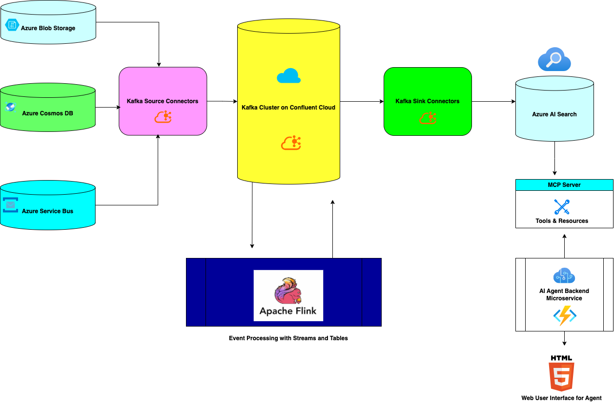
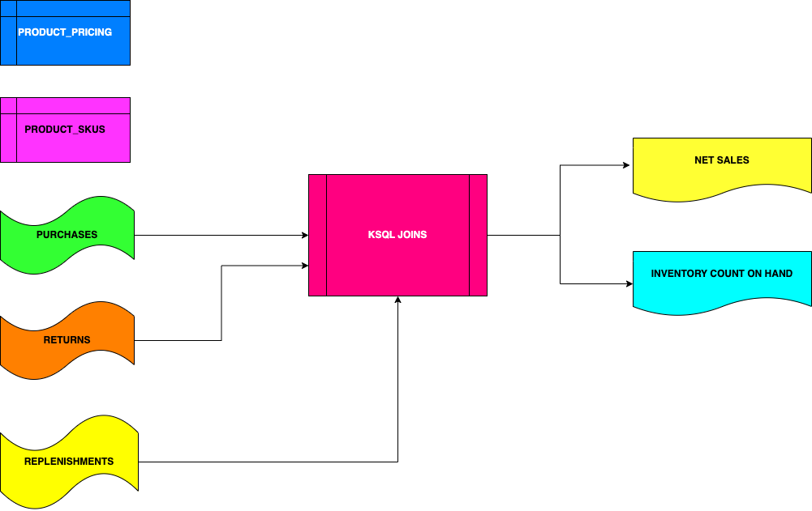

# Confluent/Microsoft Hackathon 

Join us for an immersive hackathon experience where you'll build a cutting-edge AI agent using Confluent Cloud on Microsoft Azure. This event is designed for innovators eager to harness the power of real-time data streaming to drive intelligent decision-making in today's fast-paced digital landscape.

## Why Participate?
In a world where data chaos can slow progress, Confluent Cloud offers a unified platform to stream, connect, process, and govern your data effortlessly [1]. Leveraging the robust, open-source foundation of Apache Kafka, Confluent Cloud unlocks the true potential of real-time applications and event-driven architectures. Its market-leading capabilities in scalability, resilience, security, and data quality make it the perfect partner for building an AI agent that demands up-to-the-second accuracy [2].

## What You'll Do
During the hackathon, you'll dive into the world of data streaming by setting up pipelines that capture and process retail data—from product SKUs and purchases to transaction returns and inventory replenishments. Using over 200 pre-built Kafka connectors [4], you'll seamlessly ingest data from diverse sources. Then, using Apache Flink or KSQLDB within Confluent Cloud on Azure, you'll process these streams in a serverless environment to consolidate events into a single, near real-time topic. This consolidated data forms the backbone of your up-to-date database, crucial for powering an AI agent that delivers precise insights and optimal experiences to customers, employees, and suppliers alike [3].

## The Impact
Data freshness is at the heart of effective AI, and by mastering the art of real-time data streaming, you'll empower your AI agent to respond accurately and swiftly. Whether it's guiding customers through personalized recommendations, optimizing inventory levels, or streamlining supplier interactions, this hackathon will equip you with the tools and knowledge to turn raw data into actionable, intelligent insights.

Come transform the future of retail and data streaming—build faster, scale smarter, and revolutionize how businesses interact with real-time data using Confluent Cloud on Microsoft Azure.

## References
- 1 https://www.confluent.io/apache-kafka-vs-confluent/
- 2 https://learn.microsoft.com/en-us/azure/partner-solutions/apache-kafka-confluent-cloud/overview
- 3 https://learn.microsoft.com/en-us/azure/partner-solutions/apache-kafka-confluent-cloud/create
- 4 https://www.confluent.io/hub/ 